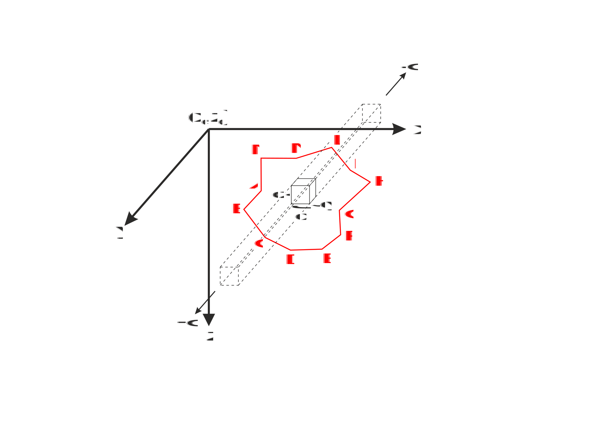
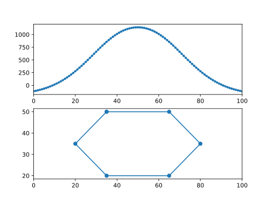

User guide
###########

Theoretical Background
======================

For a theoretical explanation, let us consider a three-dimensional non-magnetic 
space in which a body infinitely extended in the :math:`\mathbf{y}` direction is immersed. 

The common aim of all formulations is the calculation of the magnetic field of 
this body upon an observation point (:math:`\mathbf{x}_0` , :math:`\mathbf{z}_0`) located along a profile aligned to 
the :math:`\mathbf{x}` direction (the positive :math:`\mathbf{z}` axis is assumed pointing downward).

The starting assumption is that our body can be considered as discretized by an 
infinite number of uniformly-magnetized elementary volumes with infinitesimal dimensions :math:`\mathbf{dz}`, :math:`\mathbf{dy}`, :math:`\mathbf{dz}`.

Within this assumption, the magnetic field associated to the body can be mathematically 
expressed in terms of a line integral around its periphery, represented in two dimensions 
as its polygonal cross-section (in red).

Tutorial
========

First load the module and define some magnetization vectors,

.. code::

   import mag2dpoly as mag 

   # induced magnetization
   Jind = mag.MagnetizVector(mod=4.9,Ideg=90.0,Ddeg=45.0)
   # remanent magnetization
   Jrem = mag.MagnetizVector(mod=3.1,Ideg=45.0,Ddeg=0.0)
   

and then define some observation points 

.. code::

   # angle with the North axis
   northxax = 90.0

   # number of observation 
   Nobs = 101
   xzobs = np.transpose(np.vstack(( np.linspace(0.0,100.0,Nobs), -1.0*np.ones(Nobs))))
   
   

Finally the general list of vertices of the poligonal bodies and the relative indices mapping each body to its vertices:

.. code::
 
   # vertices of the poligonal bodies
   vertices = np.array([ [35.0, 50.0],
                         [65.0, 50.0],
                         [80.0, 35.0],
                         [65.0, 20.0],
   	                 [35.0, 20.0],
	                 [20.0, 35.0] ])
			 
   # indices of vertices for the body
   nbod = 1
   bodyindices = np.empty(shape=(nbod,), dtype=np.object)
   inds = range(6)
   bodyindices[0] = np.array(inds)
   
   # construct the poligonal body object
   pbody = mag.MagPolyBodies2D(bodyindices,vertices)
   

At this point the total field can be computed. We select `"talwani"` as the forward type:

.. code::

   # type of forward algorithm
   forwardtype = "talwani"
   
   # compute total field 
   for i in range(nbody):
       tmag += mag.tmagpoly2Dgen(xzobs,Jind,Jrem,northxax,pbody.bo[i],forwardtype)

Now we can plot the results:

 

